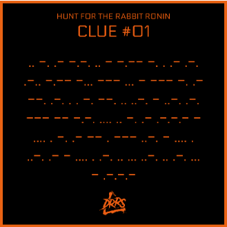
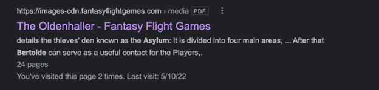
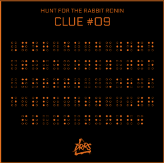
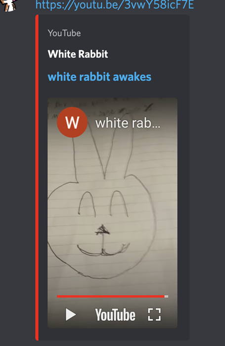

# The Hunt for Rabbit Ronin

The Hunt for the Rabbit Ronin goes live the instant the Dead Rabbit collection mints.

10 clues are hidden in the HRR QR Code Ear Tag trait featured on some Dead Rabbit NFTs.

Crack the clues, then solve the riddle in each. The first to solve all ten will discover hidden info that allows them to claim the prize: Yamarashi, the Rabbit Ronin (1 of the 6 Alien Rabbit God NFTs!) + 5000 ADA.

The Hunt for Rabbit Ronin began on the day of the public mint with those instructions. Included was a picture of one of the HRR ear tags for the first cipher, however, there were multiple copies of each QR code on many different Dead Rabbit NFTs. These could be viewed, scanned, and solved by anybody with access to pool.pm or Cardano dApps. Ownership of any specific is not required, though having at least one rabbit was a requirement to claim the final prize. Thus begins our journey...

### Hunt for Rabbit Ronin #1

By $alex.ada

Decoded from Morse Code into:

> INACITYNEARLYBOSTONAGREENGIFTFROMCHINA.THENAMEOFTHEFATHERISFIRST.

With spaces and punctuation added manually:

> In a city nearly Boston a green gift from China. The name of the father is first.

So for me, @$alex.ada, this one was the first one I felt confident about, but was dead wrong. I had never dealt with ciphers before, but @soggy waffles gave me the original deciphered clues. So I went off that. At this point almost everyone was saying the answer was Sun Yat-sen because of a green gate in Boston. But I stuck to the fact it was "NEARLY" Boston. So I figured out that Cambridge was close to Boston then found out that Harvard had just gotten a lot of flak for accepting a 350 million dollar gift from China. I did some more digging and found the Father of that gift was this guy named Gerald Chan. So I was completely convinced I had it. I got all excited and started telling @soggy waffles about it.

Then a day or so later we found the information about the Portland Penny and realized the answer had to be something in Portland. So I immediately shifted my focus. And just like almost everyone, came up with Lan Su Garden and the Lake Tai Rock. A few days later when the first clue from Jeb came out (twitter post) it confirmed to us that the answer was something in Portland. I had settled on either the Mayor of Suzhou as the father of the Lake Tai Rock or on the "Godfather of Old Chinatown" Bill Naito. Then moved on to the others. Well, a week or so later, Jeb said we would be able to verify all the answers, and I had found proof of #4,5,&6, so I knew there had to be something better for #1...so I decided to ask for help from people in Portland. My first attempt was to call the Lan Su Garden. I talked to them then got an email address for their education director and emailed her, but I wasn't satisfied with that, so I took to Reddit. I went and joined the Portland sub and asked the question there. That day I got 3 or 4 responses saying "oh this has to be Da Tung and Xi'an Bao Bao!"

[http://www.villageframeandgallery.com/blog/celebrating-fathers-2016/](http://www.villageframeandgallery.com/blog/celebrating-fathers-2016/)

After I found the page I realized this HAD to be it because I finally had a GREEN GIFT (it's copper which turns green as it patinas) from China (made by a Chinese foundry) and a Father (it's a father and baby elephant) I shared this with @soggy waffles and we thought we had it in the bag. But then we kept trying to figure out an email address and we're getting nothing that worked, so we decided one of our other answers, (either 3 or 7) had to be wrong. I knew that @$cerkoryn and @J4vaJ4ne didn't have #1 yet because @J4vaJ4ne found the Green Man of Portland by Daniel Duford, which they were convinced of. So I decided to propose merging our team to share all our answers. Once we merged we talked about it and realized we had all been down the same basic rabbit holes of the garden and the rock, and that there was no doubt that **Da Tung** HAD to be the answer.

### Hunt for Rabbit Ronin #2

By BenjaminTheRelentless

ROT-13/Caesar Cipher

> The head of the King was stolen from a beetle in the hand of a troll. Under what is second.

Riddle 2 started off with the cipher above scanned from an HRR#2 ear tag. This one was pretty clearly a letter substitution cipher which turned out to be ROT-13, each letter being replaced by the letter 13 places off of it in the alphabet.

The answer: Aurora Bridge

This was one of the few answers that we all came to independently as the riddle ends up being highly specific and was merely a matter of a few google searches for trolls and beetles before you find this:

[https://en.wikipedia.org/wiki/Fremont\_Troll](https://en.wikipedia.org/wiki/Fremont_Troll)

The portion about the bust of Elvis Presley being stolen was more than enough confirmation.

The only real trouble we had was towards the end of the hunt, when we had "all the right answers" but still weren't winning. At which point we had to consider an additional twist where the answer might be another name for the same bridge:

- George Washington Memorial bridge

- Route 99

- Just "bridge"

- Or maybe even "Overpass"

Fortunately we never got away from our original and correct answer : **Aurora Bridge**

### Hunt for Rabbit Ronin #3

By $alex.ada

Rail Fence Cipher / Columnar Transposition Cipher

> The most popular spell. Third of course.

#3- the Spell...

Turns out this one is the hardest of all the clues! I, @$alex.ada, ended up solving it, but only after lots of other theories were tested by all of us. As most of you reading this know, in 2019 D&D beyond came out with a video of most used spells in D&D, and it had Cure Wounds as number one. But looking back, it's obvious that "most used" doesn't mean it's the most popular. The kid everyone has in their phone book in high school to text when they need someone to write their paper isn't the most popular kid. But at the time this video had all of us fooled.

For us the realization we needed to find something else came with the clue from Jeb. It said "why of course" which reinforced that we needed to have an answer that involved the number "3". Immediately my teammates found "charmed person" because "being charming makes you popular" and "third times the charm." I felt like this was shoehorning something into the answer that isn't there, because neither of those have anything to do with the D&D spell. So, I kinda went off on my own on this one.

The first answer I found was "the Power Of Three" spell from the Charmed series. Which is the most popular spell used in Charmed. Ok, so I had an answer that actually filled all the checkboxes for this clue. But, the thought of Jeb, this middle aged bearded man, sitting around watching a TV show about high school girl witches (or Harry Potter) was too much. So, I went back to the drawing board. I decided it HAD to be something from D&D. So I went on a hunt for spells that involve the number 3. I first came up with Fireball because I figured out it was a spell you had to be 3rd level for and that it's the quintessential D&D so it seemed like a strong possibility to me.

A day later I watched the entire D&D beyond video where he talks about the most used spells for every class. I got to looking and figured out that a lot of the classes that used Cure Wounds didn't have the ability to cast spells in older editions. I knew that Jeb would have grown up playing 3e or 3.5e, so I thought that could be the correlation to 3 and amongst the ones that would have been spellcasters in those editions, it looked like Healing Word was the most used spell. So I told the team I think it's Healing Word and that we can get rid of Fireball.

During all that research, I had also turned back to Reddit and posted the riddle and clue in the D&D Reddit. So yesterday I remembered that I had done that and went back to see if anyone responded, and I had 2 responses that said it was "obviously Fireball" and those responses had multiple likes. So, I went back to the group and told them this, and we added Fireball back. I was pretty confident it had to be Fireball after my earlier reading and now Reddit, but my team was less convinced. It was added it to the list but it also started a debate about why they all thought Charmed Person was the better answer. I told them how I thought the reasoning was shoe horning things in that didn't fit, but they all disagreed.

At this time I was using Protonmail to validate a big list of email addresses that used the first word of each answer, and was getting nothing. I was frustrated with the email thing and with the discussion, so I put in "DTABFHLMSYSIB1342@protonmail.com" into Protonmail just because I thought "wouldn't it be funny if that was actually it after all this?" And it came back as a verified email. So I sent an email to it just asking "have you seen Yamarashi?" From the prior things Jeb said, I expected the correct email address to send an immediate auto reply, but I didn't get one. So I messaged the group and said "well I just tried "DTABFHLMSYSIB1342" and it worked, but I didn't get a response so I I guess that isn't it." They were all amazed that it was a real email and told me it seemed oddly specific for one that isn't the answer. I just kept going looking for any valid emails in the list I was trying and then..

I just kept going looking for any valid emails in the list I was trying and then after 15 or so minutes I happened to notice I had an unread message, and that it was from Jeb! I read it and he had confirmed we had finally won. That confirmed that Fireball was actually the correct answer to Riddle 3. I literally YELLED "HOLY F\*\*K" and scared my dogs and my 2 year old son. :joy:

### Hunt for Rabbit Ronin #4

By $cerkoryn

This one is a Nihilist Cipher that decodes using the provided key, "rabbit." The [AZ-J] is also important as you'll see shortly. The decoded ciphertext is:

> The maker of iebs favorite droid is fourth.

Unfortunately, this confused many different groups, including our own, for far longer than it should have. We set off to discover what "ieb" was, and early in the competition the general consensus leaned toward IEB Business School in Spain. We found that the founder and CEO of the school was Oscar Fuente, so we sent him a message asking what his favorite droid was. I can only imagine how many calls and texts he got from other rabbit hunters. :joy:

At some point, we finally took another look at the cipher and realized that since it uses a 5x5 grid, only 25 characters were possible. The "-J" in the ciphertext informs us that the J is taken out, and we can see through research on Nihilist Ciphers that it is standard to use the letters "I" and "J" interchangeably. Once we were sure that the riddle was asking for Jeb's favorite droid, we were able to quickly an old message from him in the Discord asking a question about the maker of IG-88, to which another member answered "Holowan Labs." This gave us an answer, but not quite with 100% confirmation yet. That, we came upon by accident when we ordered the Zombie Circus Goats game Jeb and friends created. When we opened the box to play it for the first time, we were pleasantly surprised to see this card:

Note that this can also be found on the ZombieCircusGoats.com web page, so it did not require a physical copy of the game to see.

### Hunt for Rabbit Ronin #5

By soggy waffles

Decoded as a Bacon cipher to:

> Bertoldos keyword for the asylum is fifth.

Day two of the Hunt, with no teams yet formed, I hopped on a call with dear old Mom to talk through this daunting list of 10 riddles. Over the course of our conversation we swiftly discovered a simple google search of Bertoldo "the Asylum"(the "the" here seemed to be important) yielded the most beautiful result:

Oh hello Oldenhaller Contract!! After a quick read the password used to enter the Asylum became the obvious answer to the riddle. Oh you beautiful "Malindi".

Piece of cake, right?

(Notice "Charm" in that paragraph? Let's just not talk about that PIA.. lol)

Earlier this same day I shared the 10 cipher solutions with @$alex.ada. Lighting a fire that would ultimately consume are normal lives for nearly 3 weeks.

### Hunt for Rabbit Ronin #6

By $alex.ada

Tap Code Cipher that decodes to:

> the best line Gandalf says to Saruman is sixth

This is another one that gave a lot of people grief. This question seems so subjective, and difficult to answer. I, @$alex.ada, have never been a huge LOTR fan. I watched the first movie one time, and read The Hobbit, but that is the furthest my knowledge of LOTR goes. So, once that @soggy waffles sent all the decoded ciphers to me, I took a wild guess and asked him "Number 6 is "You Shall Not Pass", right?" and @soggy waffles must have been laughing as he told me that line wasn't said to Saruman. So, I had to go and research who Saruman was. After that, I went and did a Google search and came up with a line about him liking white better. Since I didn't have much reference to go off of, I just went with that as my answer and moved on to others.

A couple days later, I was scouring everything I could find about Jeb while trying to figure out what his favorite droid was. I wound up on the West Coast Scavenger Hunt write up on his board game website, and was reading it, when I clicked into the "Semi-Golden Ticket" page (https://zombiecircusgoats.com/semi-golden-ticket/). As I read through this page the Words "a voice like Gandalf's reached out and hit me like the smell of an overused porta-john hits you when you go in it at the fair on a 100-degree day. BAM! I mean, Jeb straight up tells us the answer right there! I immediately went to YouTube to find the scene, and once I found it, I was crazy excited and spammed the eff out of @soggy waffles DM's to tell him all about it. For me, this was the first answer I was able to confirm with something Jeb actually said, so it gave me a HUGE boost of confidence that the answers not only could be solved, but confirmed as being correct.

### Hunt for Rabbit Ronin #7

By BenjaminTheRelentless

The encrypted riddle for Riddle 7 is found from scanning the HRR#7 ear tag QR code.

This is a base 32 encoded cipher that decodes to:

> The speed of an Awl Pike is seventh.

This riddle only really ever had two possible answers that anyone on the team pushed as the correct answer, 9 from Gemstone or 13 from D&D.

[https://gswiki.play.net/Base\_weapon\_speed#List\_of\_Base\_Weapon\_Speeds](https://gswiki.play.net/Base_weapon_speed#List_of_Base_Weapon_Speeds)

[https://adnd2e.fandom.com/wiki/PHB\_Ch6\_Weapon\_List](https://adnd2e.fandom.com/wiki/PHB_Ch6_Weapon_List)

The only issue we ran into that almost tripped us up was the thought that perhaps we should take the spelled-out version of 9 or 13, as well as the answer for Riddle 8 and use the words Nine or Thirteen, or in the case of Riddle 8, Forty-Two.

And if that was the case then surely #7 and #8 must come together to spell NFT (Nine, Forty-Two). And the answer for #7 is clearly Nine.

This was all cleared up for good by the 4th VLk\_Sys page hex answer from the library which let us know for sure that numbers aren't words and weren't to be treated as such.

> Numbers are not words, archivist. You would do well to remember it.

We were back to 99% certainty on 13 and never really looked back at 9.

### Hunt for Rabbit Ronin #8

By $cerkoryn

This decodes using ASCII85 to:

> The answer to life, the universe, and everything is eighth.

The immediate, obvious answer to this one is 42. A reference to the books/movie for Hitchhiker's Guide to the Galaxy and also a commonly known quote in popular nerd culture (of which I am a lifetime member). However, this was arguably the easiest solution to come up with, which naturally introduced some doubt. Was it meant to be this easy?

We came up with at least one alternate theory, using an article where the author, Douglas Adams, describes that 6\*9=42, but only if you count using base13. 13 was our answer for the previous riddle, so we assumed that it could possibly be a compound answer using both riddles, so we included the numbers 6 and 9 in our search.

[https://h2g2.com/entry/A4288584](https://h2g2.com/entry/A4288584)

Early in the competition, myself and many others, were convinced that the answers to the riddles would all be BIP39 words that would unlock a hidden wallet with Yamarashi and 5000 ADA in it. Many of us even were able to unlock wallets with these words! Though they all turned out to be empty.

When I was able to unlock the first one, I did it using all of the answers I had at the time except the answer to this riddle, which was 42. Since the wallet was empty, I had the idea that maybe I was supposed to send 42 ADA to it. Since I had control of the wallet with it's seed phrase anyways, I sent the ADA to it and waited for a few minutes. Then I sent it right back since the transaction would be recorded on the blockchain anyways. It was an interesting rabbit hole to go down, but it ended up being unrelated to the actual solution.

Eventually we became more confident in 42 as the correct answer due to the lack of better options, and especially after we solved the clue from the 4th hex with the hint...

> Numbers are not words, archivist. You would do well to remember it.

This let us know to use the literal number "42" instead of a variation of spelling such as "ft" from "forty-two."

### Hunt for Rabbit Ronin #9

By $cerkoryn

Recognizing this as Braille, it can be decoded to:

>⠠FOR⠀EACH⠀WORD⠀TAKE⠀ONLY⠀THE⠀FIRST.⠀⠀⠠ERASE⠀SPACES.⠀⠀⠠THIS⠀IS⠀NINTH.

If you do a little bit of reading into how Braille works, you'll find out that the . before each word actually signifies a capital letter, so the true decoded plaintext is:

> For each word take only the first. Erase spaces. This is ninth.

The first assumption that most people probably had, including us, was to take the first letters of each word from something. We tested several different things including the first letters of each riddle question, each lore entry, and even first syllables of some things. Nothing seemed to work out our spell an intelligible word/phrase however.

It wasn't until we solved the 10th riddle and got the clue, protonmail.com that we started to lean toward it being an email address, although we had MANY different theories:

With the host of different answers and theories that we had for each question and for the final solution, we decided that we needed a way to check lots of different answers very quickly. Fortunately, a few of us have some experience with Python so we wrote a fancy tool for coming up with lots of different permutations and checking them programmatically. I will add a disclaimer here that there was no actual hacking or illicit activity done, as all this tool does is create a wordlist of different permutations on your local computer and then attempt to navigate to a URL by that name, all which could've been done by hand as well. In fact, we made the extra effort to put a generous delay between HTTP requests to ensure that we weren't bogging down the site with too much traffic.

Although our efforts to find a hidden web page came up empty, we were able to use the tool to solve the 4th hex within short time of its release simply by searching through the entire "library" under the hex name that was given. We had this capability ready to go in advance because the word "penultimate" in the 10th Riddle gave us the assumption that there would be another Library of Babel clue, and that ultimately paid off for us when we got the clue after letting the program run for about an hour, the second line of which was decoded from ROT-13:

> Still in the library I see, archivist. Many have found the key, none have used it.

> Numbers are not words, archivist. You would do well to remember it.

For over a week we tried coming up with new wordlists and email addresses based on our answers to each of the riddles. We actually had all the correct answers for over a week, but unfortunately had set aside "Fireball" as the answer to the 3rd riddle in favor of "Charm" in most of our permutations. Funnily enough, I managed to get my Gmail account banned from attempting to send mail to hundreds of different addresses which they flagged as spam. Fortunately, they restored it after a painful two days without Gmail or YouTube 😂 . We also found out that we could validate emails easily using Protonmail.com without having to send first. Oops.

@$alex.ada made a case for "Fireball" as an answer to Riddle 3 again, but decided to remove it from the list of candidates before we tried it in our email combinations. However, he eventually revisited the idea after Reddit overwhelmingly suggested it was the answer, plugged in the letters+numbers out of spite, sent the email, and was greeted with a response from non other than Jeb Tesseract himself:

### Hunt for Rabbit Ronin #10

By BenjaminTheRelentless

Polybius Cipher. Decoded riddle:

> Find the clue in the warrens this is last.

The night the Dead Warrens channel opened in the DRRS Discord we were there to check the clue immediately. In the channel description, we found:

I see moons that hide behind our moon. I see the shadow that lurks beneath the day. I bring rabbits silver, and darkglass, and maps of stars. Three hexes I have inscribed on the VLk\_Sys page. Use them to fetch Dead Tomes from the tower, archivist. Wall 2, shelf 2, volume 1, page 153. I shall read to you of the old ways. All I ask for in return is a bit of your blood. -Tialoc Tesseract, the Undersun

@gary recognized the allusion to the Library of Babel site and we started working out what the appropriate hex was to use. He recognized that each stanza from the VLk\_Sys page had the same number of characters and that the number of characters was almost but not quite the maximum character count on the hex name entry box at the Library of Babel and decided to paste in the whole 1st stanza. At that point we found each successive cipher in the library and solved to get the next wall, shelf, volume and page coordinates.

Solving the cipher gave us the wall, shelf, volume, and page for the next hex name. We followed this process until the 3rd hex was done, the solution that was revealed was:

> Our penultimate meeting, archivist. It is bittersweet. cebgbaznvy.pbz

Using ROT-13, we decoded the last part to:

> protonmail.com

We strongly believed we needed to either send an email to or log in to a particular Protonmail account. But we still needed to figure which account it was that the clue was steering us toward and if we needed to send an email to it, what would the message be ? If we needed to instead log in, which password do we use? Amongst the whole group, we tested thousands of different combinations before we finally landed on the right one.

### Other Clues

By $cerkoryn

A Tweet from the official Dead Rabbits Resurrection Society Twitter account included the following image that contained two clues:

[https://twitter.com/DeadRabbitRS/status/1518590658797359104?s=20&t=XgRu-IUGv6PFC1fXx5kUZQ](https://twitter.com/DeadRabbitRS/status/1518590658797359104?s=20&t=XgRu-IUGv6PFC1fXx5kUZQ)

The first clue was:

> 331511423154333444331511424434333444331511421254

Which is a Polybius Cipher that decodes to:

> NearlyNotNearToNotNearby

The second cipher:

> 0110101101101110011011110110001101101011001000000110000101101110011001000010000001110111011000010110100101110100

Is Binary interpreted as ASCII code that becomes:

> Knock and wait.

"NearlyNotNearToNotNearby" was a hint that the answer was referring to the geographic area near Boston, Massachusetts regarding Riddle #1.

"Knock and wait" was a quote from the Oldenhaller Contract for Riddle #5. The full quote:

> The doorway pointed out by the guide opens onto a steep flight of stairs which leads

> down to a narrow passage. After about ten feet, the passage ends in a door. A notice

> pinned to the door reads, "Observe the Laws of Asylum Knock and Wait"

There were also a few other ciphers posted on the VLk\_Sys page, such as:

> K5UHSIDPMYQGG33VOJZWKPY=

Which was base32 that decoded to a hint for Riddle #3:

> Why of course?

And this one:

> =(,o]+>b3>BOu!l+>Y-@DepOQ+E1s91H@,

Which was an ASCII85-encoded solution for the infamous 4th hex:

> Wall 4 Shelf 3 Vol 4 pg 390

And finally, a 5th hex was posted to the page together with this string that contained the wall/shelf/volume/page needed to solve it:

> 5211313134331543231531212124511551343145321515242223441515333511221544523415242223445421344542

Polybius cipher for:

> Wall one shelf five volume eighteen page two eighty four

This yielded the final clue for Riddle #9:

> we meet again, archivist. ryhulqfoxvlyh wkrxjkw dqg d orrvhqlqj ri dvvrfldwlrqv duh slwidoov ri > jurxswklqn. wr pdnh wkh nhb, vlpsob gr zkdw lv dvnhg. wr xvh wkh nhb, vlpsob gr zkdw lv lpsolhg. > bushbashing monoamine

Which decoded using ROT-3 to:

> we meet again, archivist. overinclusive thought and a loosening of associations are pitfalls of > groupthink. to make the key, simply do what is asked. to use the key, simply do what is implied.

This motivated us to keep trying letter combinations for emails which is what gave us the final solution.

### The Abrasive Dead Rabbit

By $soggy waffles

Remember this? On the homepage in the "Sold Out" graphic many of us noticed:

TTS LOCAL P-34.34-3 | CONTROL P-34.34-3 FIX

W 41°24'12.2" E 23°44'54.4"

PE-3 NVGT B

A quick google later and now we're sitting with a pile of PDF documents containing this exact same cryptic message and coordinates:

And then on the Bulgarian border Nova was found!!!! Yamarashi, is this where you live?!? Potential Node Key location?

But our Dungeon Master set us straight…

### Interrogating Jeb's Friends

By $alex.ada

Soo, in my quest to figure this thing out, I realized Jeb allowed us to ask for help, but we weren't allowed to ask members of the team.. well, I thought I would be clever and ask Taylor, who is his partner at his game company. So, I found her contact info on her website and sent her an email.. her response was pure gold..

My message,

Taylor's reply:

### Oliver Pike

By $alex.ada

Oliver Pike- so someone I was talking to introduced me to Mr. Oliver Pike.. he is a physicist that figured out how to make matter out of light with technology we have today. That got me thinking that maybe Awl Pike was a clever way to say Oliver Pike and that the answer to #7 was Ultrarelativistic since that is how fast they have to make the photons travel to slam them together and get matter.

Along that same path, someone I was talking to had a whole theory that all the answers were related to gods. I didn't really buy into it, but, after protonmail was solved, I discovered protonmail was made at CERN. That combined with Oliver Pike, who was/is conducting his experiments in the large Hadron collider, had me looking at the Tunnels it is in as a possible ending point (Yamarashi stuck in the tunnels) so I started researching CERN, and came across this article that talks about the town CERN is in being the ancient "gateway to the underworld" along with having a lot of occult and god symbolism through the center. Which led me to look at the other god theories more seriously. ([https://www.rt.com/op-ed/313922-cern-collider-hadron-higgs/](https://www.rt.com/op-ed/313922-cern-collider-hadron-higgs/))

I spent at least one full day trying to figure out how to "time hop {local} to post creation event" by saving a copy and editing the whole VLK\_sys\_check page. I have very minimal knowledge of web design so I was really just googling stuff then trying it.

Every set of letters I came up with would show up as a vigenere cipher on dcode.fr, so I learned WAYYYYYY more than I will ever need about vigenere ciphers. I actually at one point got the first half (with the f for fireball) to say "sendusyo" using a vigenere cipher.. I really thought I had it then.

When the 3 hexes came out, dcode told me they were Pollux ciphers.. so I spent a good 2 days figuring that cipher out before someone told me what it really was

### When ARGs collide (Augmented Reality Game vs Alien Rabbit God)

By $soggy waffles

One of the more random discoveries along this journey. While researching ciphers on a certain discord server I came across this:

"White rabbit awakes."

Crude pen drawing of a rabbit. The post is dated a couple days before I found it. With only 4 or 5 views. Damn, I thought, this has to be something!!

Low and behold I find a cipher on the YouTube page!!

Decoded to:

you come this far why not go further,

MMMkkkkk, so obviously check for other videos on the account…

And here we go again:

"I fear the sun"

Accompanied by a borderline serialkiller-esque video clip:

With another cipher!!!

Decoded to:

you come to watch me sleep? the dead don't sleep we wait. you come to help me sleep? the dead don't sleep we wait.

Did I just find Dead Rabbits watching me sleep?!?!

Sadly no. What I stumbled across was the long running OIEC ARG.

### Bert and Ernie Oldoskey

By $soggy waffles

On day 1 after decoding the 5th cipher I saw 2 possibilities (among many):

1. Bertoldos keyword for the asylum is fifth.

2. Bert Oldoskey word for the asylum is fifth.

Hilariously a quick google search for Bert Oldoskey immediately dumped Sesame Street into my lap. Which is odd, because as far as I know Bert and Ernie don't have last names,… right?

### YamarashiBot

By $cerkoryn

In addition to RabbitOS for trying to come up with wordlists quickly and test them as answers, we decided to come up with a method of notifying everyone as soon as a new clue gets posted so that we don't lose time. Thus, YamarashiBot was born:

